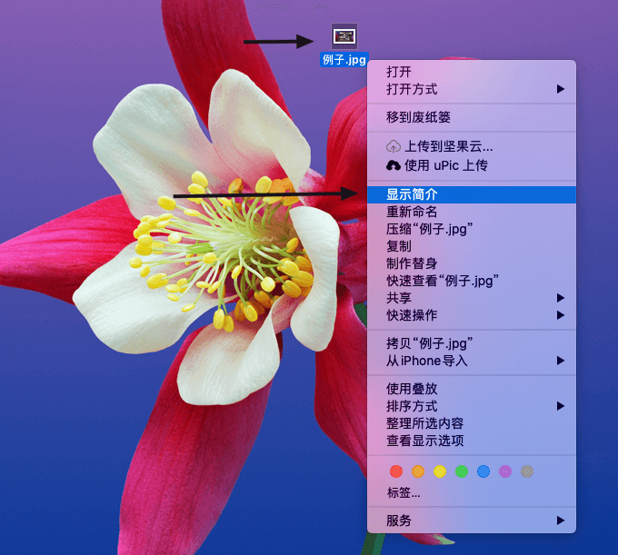
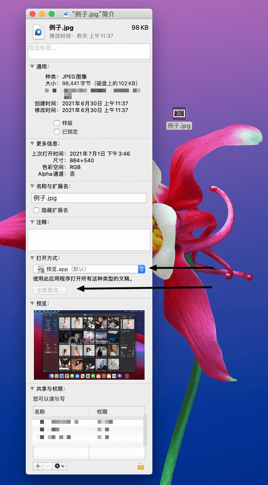

经常有用户问起，怎么设置图片的默认打开方式为Picsee。这里介绍两种方法，一种通过界面操作设置，但局限于一次只能设置一种格式，如果一次性想设置多个格式，是比较繁琐的。......<!-- more -->另一种方式通过命令行操作，支持一次设置多个格式的默认打开程序，比较灵活，有点繁琐。

## 界面操作设置（一次只能设置一种格式）
鼠标移动到要修改默认打开程序的图片文件上，例如"例子.jpg", 鼠标右键，在弹出的菜单中点击”显示简介“，如下图。


在显示简介中，在打开方式中，选择Picsee.app, 然后点击全部更改，关闭显示简介，这样，这种格式设置成Picsee默认打开就设置完成，如下图。


## 命令行设置（一次设置多个格式）
这种设置方式，需要借助命令行工具。步骤如下：

- 打开命令行（终端）工具。
- 安装包管理工具[Homebrew](https://brew.sh/index_zh-cn)，复制下面这行代码到终端中，回车执行。（安装过的请略过）

```bash
/bin/bash -c "$(curl -fsSL https://raw.githubusercontent.com/Homebrew/install/HEAD/install.sh)"
```

- 安装[duti](https://github.com/moretension/duti)工具，一个修改文件默认打开程序的命令行工具。复制下面这行代码到终端中，回车执行。（安装过的请略过）

```bash
brew install duti
```

- 点击配置文件:<a href="/blog/images/Default_open/duti_picsee.config" download>duti_picsee.config</a>，下载duti的执行参数配置文件。
- 执行duti命令，修改Picsee欲关联格式的默认打开方式。复制下面这行代码到终端中，并把“<.../duti_picsee.config>”替换为duti_picsee.config全路径名称，回车执行，或者直接在终端输入"duti ", 再直接拖拽下载到的duti_picsee.config到终端里，回车执行。

```bash
duti <.../duti_picsee.config>
```

- 设置完成。


### duti_picsee.config配置文件

[duti_picsee.config](./images/Default_open/duti_picsee.config)文件如下：

```bash
# 一行代表一种格式的设置, 此文件最后一行必须是空行
#
# 图片文件
me.zhiquan.mac.Picsee    public.jpeg  all
me.zhiquan.mac.Picsee    public.png  all

# 如果需要添加其他格式，复制一行，修改"public.png"为对应格式的UTI, UTI通过mdls命令获取
#
# 矢量文件
me.zhiquan.mac.Picsee    public.svg-image  all
#
# 动图
me.zhiquan.mac.Picsee    com.compuserve.gif  all


```

### 参考命令

1. 查看某个格式的默认打开程序：

```bash
duti -x sag
```

2. 查看某个文件的UTI：

```bash
mdls test.txt
```

### 参考文章

- [设置 Mac 下文件的默认打开程序 — duti 详解](https://segmentfault.com/a/1190000004395085)