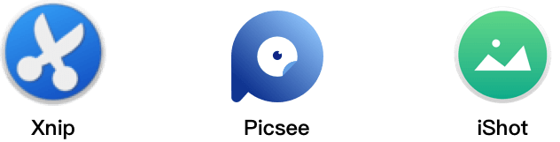
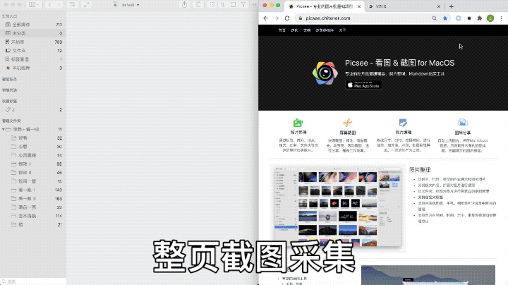

长截图，即滚动截图，是指一个页面区域，当前屏幕范围容纳不下需要截取的内容，需要滚动该页面区域，截取不同的内容，进行拼接获取完整页面内容的操作，......<!-- more -->例如浏览的网页，聊天内容常常需要长截图。

目前了解到，Mac平台上，支持长截图的工具，按时间出现顺序有：Xnip、 Picsee、iShot, 早期Snip也是有这一特性，但是随着版本的迭代，现在从Store上下载安装的，已经没有这一功能。至于通过浏览器插件，单单只能截取网页长截图的，不在这讨论之列。

至于为什么要讨论长截图，因为在没有系统层面API支持的基础上，通过截取多张图片，用算法实现拼接获取长截图的方式，总是存在一定程度的瑕疵，我想，这也是为什么Snipaste迟迟没有推出长截图功能的原因，并且各款长截图软件在图像拼接算法，系统性能平衡点、实现方式上是不同的，这些不同，常带来不同的使用体验。因此，比较各款软件，在各种环境下，长截图实现的完美程度，存在一定的意义。通过比较，发现问题，提升用户体验。

这三款软件都能通过App Store下载获取使用，这里对比测评分别采用最新版，[**Picsee**](https://picsee.chitaner.com/)是1.2.3版本，[**iShot**](https://www.better365.cn/)是1.7.7版本，[**Xnip**](https://zh.xnipapp.com/)是2.2.0版本。

## 长截图操作逻辑

针对可滚动的页面，截图框选一定的区域，点击长截图工具，鼠标在滚动页面的框选区域内垂直滚动，在截图框选区域旁边，会出现拼接的长截图，待滚动完需要截取的内容后，点击保存。Xnip、Picsee、iShot三款软件操作过程基本一致。

## 长截图功能对比

无论是Picsee, 还是Xnip、iShot，对于一般的长截图需求，基本上是能完成的。但是在使用过程中，在一些情况下，也经常遇到滚动过快、滚动截图拼接失败等问题，这降低用户使用效率，影响用户使用体验，也决定了一个工具软件的优劣。下面从滚动区域框选、滚动方向偏移、滚动区域内容、操作的便利性等方面进行下对比。

| 长截图比较项 | Picsee | Xnip | iShot |
|:--|:--|:--|:--|
| 滚动区域框选适应性 | ⭐️⭐️⭐️⭐️⭐️ | ⭐️ | ⭐️⭐️⭐️ |
| 滚动方向容错性 | ⭐️⭐️⭐️⭐️⭐️ | ⭐️ | ⭐️⭐️⭐️ |
| 非纯色背景支持 | ✅ | ❌ | ❌ |
| 动态内容块适应性 | ⭐️⭐️⭐️⭐️ | ⭐️ | ⭐️⭐️⭐️ |
| 纯色内容块适应性 | ⭐️ | ⭐️⭐️⭐️ | ⭐️⭐️ |
| 动态调整滚动方向 | ✅ | ❌ | ❌ |
| 动态调整滚动区域 | ✅ | ❌ | ❌ |
| 滚动中再次拼接能力 | ✅ | ✅ | ✅ |
| 滚动速度适应性 | ⭐️⭐️⭐️ | ⭐️⭐️⭐️⭐️ | ⭐️⭐️⭐️⭐️⭐️ |
| 窗口点选滚动支持 | ✅ | ❌ | ❌ |
| 浏览器插件整页截图 | ✅ | ❌ | ❌ |
| 横向滚动截图 | ✅ | ❌ | ❌ |
| 全景滚动截图 | ✅ | ❌ | ❌ |

### 滚动区域框选
对于截取内容的框选，一般都是在滚动区域内，但日常工作中，频繁的快速框选区域，对于滚动区域的框选往往不是非常的精确，时常有超出滚动区域的范围，这时，如果长截图软件，对不可滚动的区域有一定的容错，对使用者来说，是能够带来一定的操作便利性的，而不是精确的限制在滚动区域内，一旦超出，就不能实现拼接，需要重新框选区域。测试结果，Picsee优于iShot, iShot优于Xnip, 其中Xnip对框选区域要求最严格。

### 滚动方向偏移
在浏览放大的图片，滚动截取长图过程中，是比较难做到完全的垂直滚动的，因此，长截图软件，对于细微的水平方向的偏移，需要有一定的容错，不然，就实现不了图片的拼接。测试结果，Picsee优于iShot, iShot优于Xnip，其中Xnip表现比较差，基本上实现不了长图的拼接，在其官网也介绍了使用键盘的方向键来控制垂直滚动，避免水平的错位。而Picsee和iShot都有一定程度的容错性，其中Picsee表现最好，能舒畅的实现长截图的拼接。这里需要注意点，对于需要完美的实现长截图拼接的，还是需要避免水平移动的，因为，即使软件拼接上了，也是容错错位拼接，这对于一般用用是没有关系，因为肉眼察觉不出来。

### 滚动区域内容
长截图软件，按照目前的实现方式，本质上是对图片内容的拼接，因此，使用过程中，会遇到各种各样的区域内容，对各种区域内容的普适性，是考察长截图优劣的一项重要指标。

#### 非纯色背景
聊天窗口，常常有非纯色背景，例如微信和Telegram等，测试结果只有Picsee对非纯色背景的长截图支持，iShot和Xnip都不支持。

#### 动态内容块
长截图内容区域常常有动态变化的内容，例如视频、网页动效，这也对图片拼接造成挑战，测试结果，Picsee优于iShot, iShot优于Xnip, 测试页面链接：[**https://giphy.com/trending-gifs**](https://giphy.com/trending-gifs), 这里需要说明一点，Picsee虽来能够进行拼接，但是有时是错位的拼接的。

#### 纯色区域块
对于长截图内容中，有大块纯色的区域，没有明显的特征点的时候，三款软件表现如何呢？测试结果，Xnip优于iShot, iShot优于Picsee，但都不是很好的支持。Picsee表现最差劲，直接提示框选的不是合法区域，或者拼接失败，iShot遇到纯色区域较大时，终止拼接，Xnip对于纯色区域可略过，进行后续的拼接。

### 操作便利性
对于一款工具行软件，我们总是希望它能明显的提高我们的工作效率，哪怕每次操作缩短0.1秒，也是好的。但当它操作不便捷、快速时，就一定程度上失去了它的核心价值。

#### 滚动方向调整
iShot和Xnip只支持向下滚动拼接长截图，Picsee支持上、下两个方向滚动拼接长截图，并且在拼接的过程中，可以调整方向，例如截图框选一个区域后，开始向下滚动拼接长截图，滚动过程中，意识到初定框选区域上面的区域也有内容需要拼接，这时，可直接向上滚动进行拼接。这是能够带来极大的便利性的，每次开始滚动长截图，省去了准备截图区域的操作，iShot和Xnip长截图时，都需要预先调整长截图区域，滚动到预想截图初始区域位置，而Picsee基本上可以无脑进行滚动长截图。

#### 滚动区域调整
iShot和Xnip在滚动开始后，不再支持框选区域的竖向调整，而Picsee支持在拼接过程中，再次调整竖向框选区域，这也是一个带来操作便利性的特性。因为日常截图框选中，往往没有将整个滚动页面框选进来，常是当快滚动拼接完成的时候，才发现不能向下滚动了，导致未框选进来的底部区域不能拼接，需要再一次的调整框选区域长截图拼接，而Picsee则无此烦恼，直接调整区域，就可拼接，一次完成，非常的便利。

#### 滚动速度适应性及再次拼接
在长截图的滚动拼接过程中，当滚动速度过快时，截图软件往往进行相关的提示，需要将滚动速度调慢，并且回到未拼接的区域点，进行再一次拼接尝试。测试结果，Xnip, iShot，Picsee都具有再次的拼接能力，但是在滚动速度适应性上，iShot表现最佳，Xnip次之，Picsee对滚动速度要求最高。

#### 窗口选择滚动
Picsee支持点选整个窗口进行滚动拼接长截图，相对于长截图后，进行了窗口的套壳，结合现在M1机器上能够直接跑iOS应用，这个特性非常的有意思。而Xnip和iShot，没有这一特性，都需要仔细完整的框选整个窗口的滚动截图区域。Picsee在测试过程中发现问题,点选有些窗口不能进行滚动截图，不知是什么原因。

### 其他
#### 浏览器插件
Picsee提供了浏览器扩展插件，来支持网页端的全页面长截图。目前浏览器插件只支持Chrome浏览器，且没有上架到谷歌插件商店，不过可以从[**Picsee官网**](https://picsee.chitaner.com/webExtension/)可以下载到安装。

#### 横向长截图
Picsee支持横向滚动的长截图。

#### 全景截图
Picsee支持全景360拼接图片。

### 说明
这其实是Picsee的一篇安利文章，我就是Picsee的作者，希望尽量站在客观的角度，测评Mac平台上各软件的长截图功能，一方面，能让用户了解Picsee长截图的各项特性，提升日常使用中的长截图效率，另一方面，与竞品比较，了解Picsee的不足，进行相关的改进，提升用户使用的满意度。

目前，Picsee和iShot长截图功能可免费使用，Xnip免费使用长截图有水印，需要付费升级专业版除去水印。三款软件都是国内开发者的作品，这次对比测评过程中，我还是对Xnip表现比较惋惜，因为Xnip这个功能出来的比较早，也是主打长截图功能的截图软件，这些问题，作者在官网上就有相关的说明，显然，他是早就意识到了，但是一直未迭代改善。

不喜勿喷，毕竟涉及其中，很难站在客观的角度去评价这三款软件的长截图功能以及优劣，这里鼓励广大网友进行相关的测评。