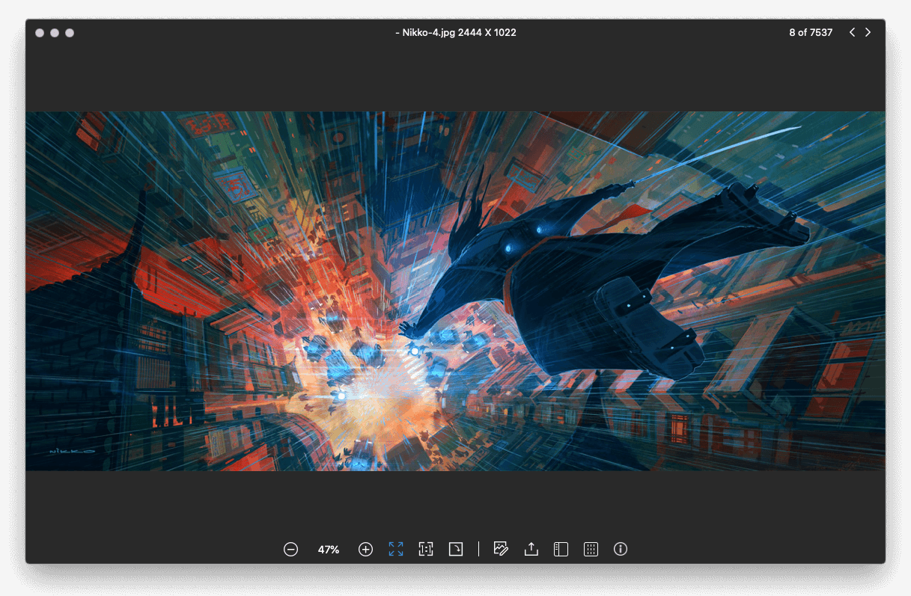
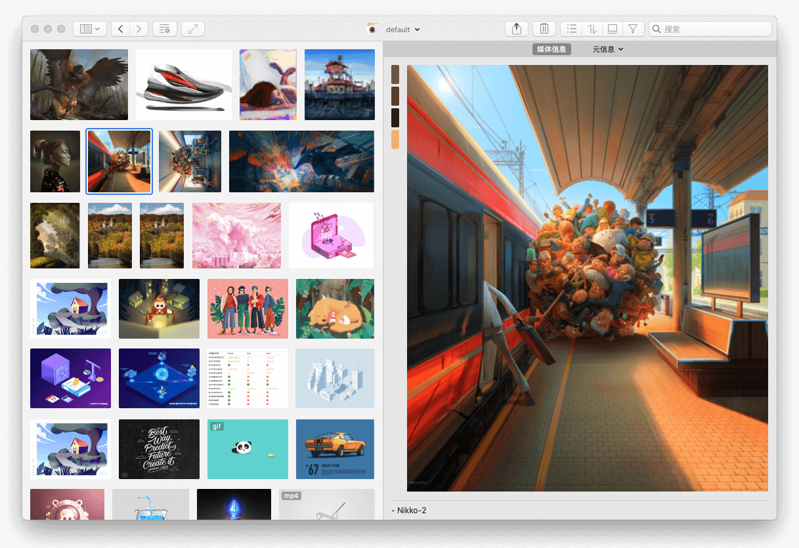

操作便捷、反应迅速、支持格式众多的图片查看器。<!-- more -->

## 特性
- 支持沉浸式浏览，无边框设计
- 支持格式丰富，直接打开psd, raw、webp等格式
- 操作便捷，鼠标滚轮放缩，抓手移动
- 支持EXIF信息的查看
- 支持格式转化，批量重命名

## 简洁的界面

## 缩略图预览 

## 丰富的格式支持

支持bmp、dds、exr、gif、pic、ico、jpeg、jpeg2000、pbm、pict、png、psd、sgi、tga、tiff、cr2、dng、heic、heif、jp2、nef、nrw、orf、pef、raf、rw2、webp、svg、ai、eps、pdf等格式

## 支持批量格式转化、重命名

