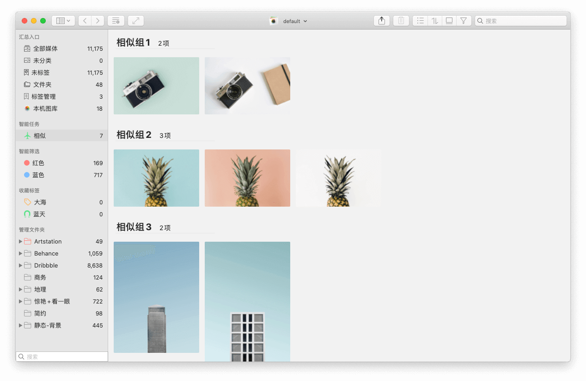
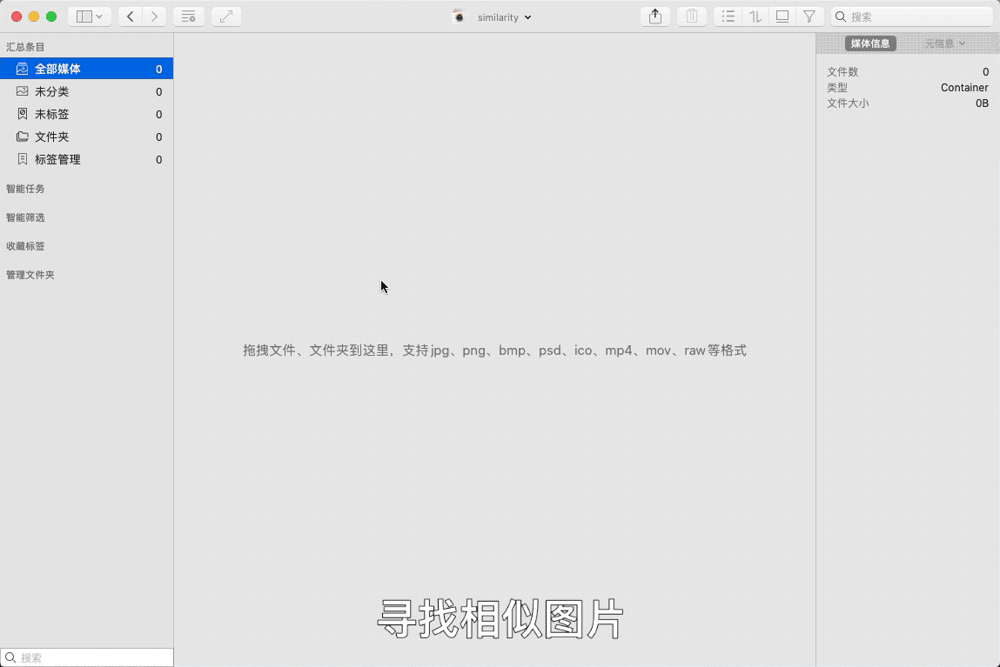

日积月累的使用，电脑上肯定积攒了有很多照片，有些照片往往是重复的或者内容相似，这占用了大量的磁盘空间，尤其是对RAW等格式大图而言。一张一张的去删除的，太耗时间，甚至有时，由于分散在各个文件夹下，根本找不到目录去删除。这时，就需要一款工具软件，能够指定目录查找、筛选重复、相似图片，找到后，进行选择删除操作。......<!-- more -->Picsee软件就有满足这一需求的功能，并且可以设定查找图片相似度数值，数值越小，筛选出的图片越相似，数值越大，图片差异越大。

## 操作流程
流程简单，符合直觉，总共分为3步：

- 添加需要查找重复照片的文件夹
- 创建相似图片查找任务，设定相似度
- 在查找结果集中，删除重复的照片

