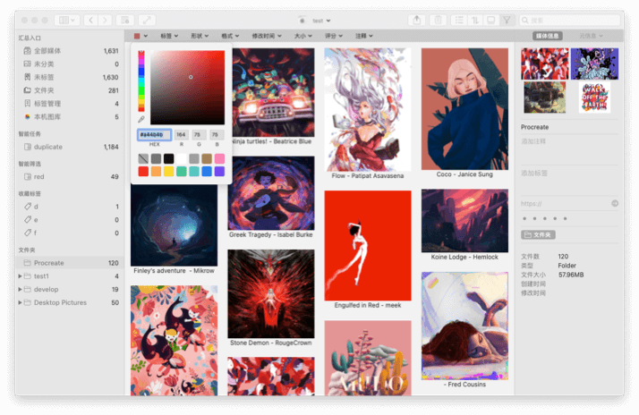

初心：构建快速、直接、可扩展、磁盘读写效率高的素材管理模式和应用......<!-- more -->

## 管理素材的方式
通过引用，监控文件夹的方式管理素材图片。对于加入资源束中的素材，在Picsee中不会复制拷贝，生成另一份，甚至每一个素材也不会必然对应生成一个缩略图留存下来，但是会解析素材图片的相关属性，例如大小、尺寸、创建时间、颜色、Exif信息存进数据库。

## 资源库和资源束
通过资源库、资源束、文件夹的形式管理素材。一个资源库管理多个资源束，资源束是素材图片的集合。一个资源束管理多个文件夹，即被监控的文件目录，存放素材图片的具体位置，通过切换资源束可管理不同的素材图片集合。

## 素材索引构建模式
通过素材在磁盘上的位置来定位和判断唯一性。添加资源束中的素材后，Picsee会在后台异步解析素材图片的相关属性，构建索引，存入Realm数据库。UI层监控数据库的变化，进行刷新。查找、筛选、排序、分栏等都是基于数据库层面的操作来支持。

## 素材缩略图问题
素材图片的解析过程不会产生缩略图，素材图片的浏览会产生缩略图，但是只有浏览到的素材图片才会产生缩略图。Picsee会在合适的时候清除很久没有访问过的素材图片的缩略图。

## 文件夹监控说明
加入到资源束的文件夹，都是被实时监控管理，在文件夹中的素材图片的变动，会及时反馈到Picsee中。但是建议在Picsee中操作图片素材，在Finder中操作的素材图片，包括删除、移动、重命名等，会在Picsee中体现，但相关的打过的标签、评分、写过的注释等会丢失。

## 云同步的实现
通过云盘同步素材图片、iCloud同步素材图片自定义扩展属性（标签、评分、注释等）、管理的文件夹绑定目录位置，三种途径实现云同步，多机、多人协作。素材图片存放在磁盘文件夹中，可通过坚果云、Dropbox等主流云盘实现多台电脑的同步；而资源束、智能任务、智能文件夹、素材图片的扩展信息等，通过用户的iCloud云端私有数据库实现多机的同步；由于，在不同电脑上，资源束中管理的文件夹，可能存放在不同的磁盘目录路径中，因此，被同步的资源束，初始需要重新绑定管理文件夹的指向的位置，即指向此时本机上，对应的通过坚果云、Dropbox等云盘同步过来的文件夹。