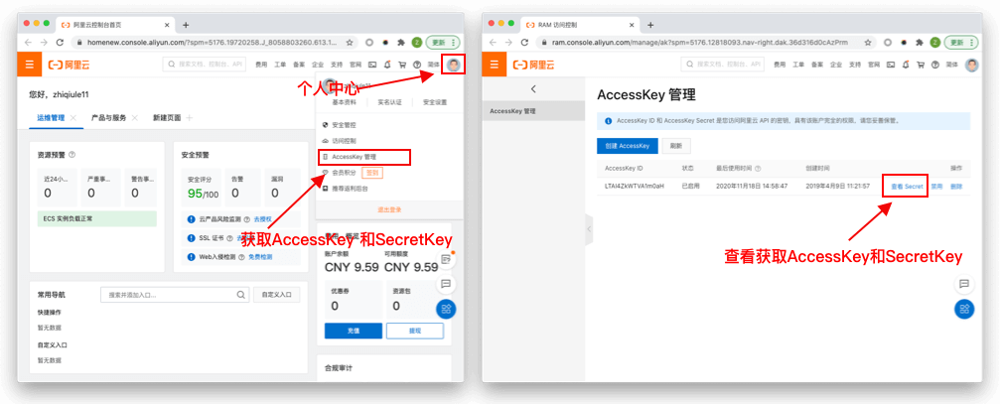
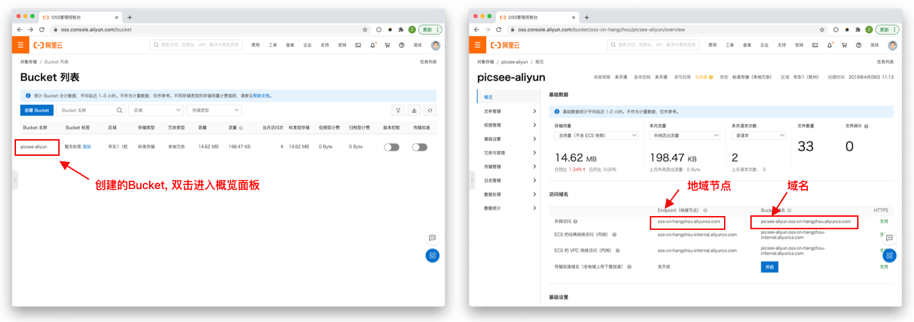
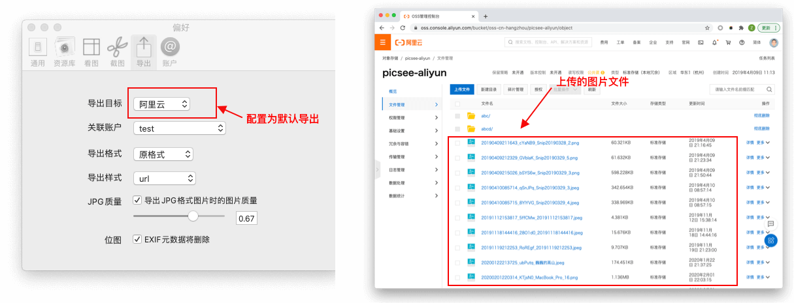

[阿里云OSS](https://cn.aliyun.com)速度快，但是费用不低。.....<!-- more -->

## 配置说明
配置前，先注册，在[官方首页](https://cn.aliyun.com)注册登录成功后，进入控制台。获取相关的配置信息。

### 名称：
**名称**：可以填入任何字符，唯一标识这个配置。

### Access Key和Secret Key
**AccessKey**: 访问密钥，**SecretKey**:密钥，进入控制台后，在个人中心, AccessKey管理中获取，**注意保管，不要泄露**。

### 储存空间
**存储空间**：阿里云以Bucket的形式管理存储空间，并以它为容器管理上传的图片文件。因此，需要创建存储空间，即Bucket。每个Bucket有一个区域（地域节点）。在对象存储OSS面板中，点击创建Bucket,在弹出的面板中，设置Bucket（存储空间）的名称，并选择相应的区域(地域节点)，读写权限设置为公共读。记录Bucket的名称，创建成功后，配置进Picsee。

### 目录
**目录**：可空，即上传的图片文件在Bucket哪个文件夹中。

### 域名和地域节点
**域名**和**地域节点**，阿里云OSS为每一个Bucket提供了一个域名和绑定了一个地域节点，以公开访问上传的图片。域名和地域节点可以在Bucket概览面板中找到。

## 效果：
添加阿里云账户后，在Picsee偏好设置的导出配置中，设置为默认导出，导出图片文件后，在阿里云的Bucket/文件管理面板中，可以找到相应的图片。

## 联系
- 详细介绍：[https://picsee.chitaner.com](https://picsee.chitaner.com)
- 邮件联系：[office.chitaner@gmail.com](mailto:office.chitaner@gmail.com)
- Telegram: [(https://t.me/joinchat/LLvGKBYvdMtz6z7SgYxJUQ)](https://t.me/joinchat/LLvGKBYvdMtz6z7SgYxJUQ)
- QQ群：663988917