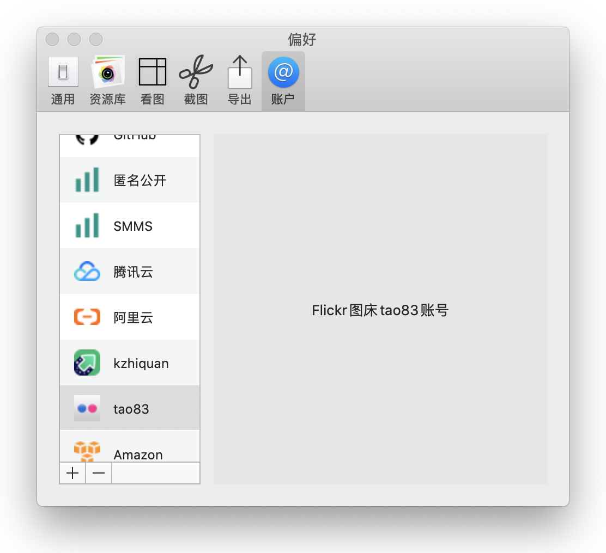
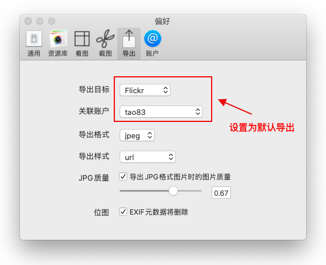

[Flickr](https://flickr.com)可以免费使用，不需要自己绑定域名，但是在国外，国内直接访问不了。.....
<!-- more -->

## 配置说明
配置简单，只要在[官方首页](https://flickr.com/)注册登录成功后。在Picsee中添加，在弹出的网页中，授权Picsee就可以了。

## 联系
- 详细介绍：[https://picsee.chitaner.com](https://picsee.chitaner.com)
- 邮件联系：[office.chitaner@gmail.com](mailto:office.chitaner@gmail.com)
- Telegram: [(https://t.me/joinchat/LLvGKBYvdMtz6z7SgYxJUQ)](https://t.me/joinchat/LLvGKBYvdMtz6z7SgYxJUQ)
- QQ群：663988917