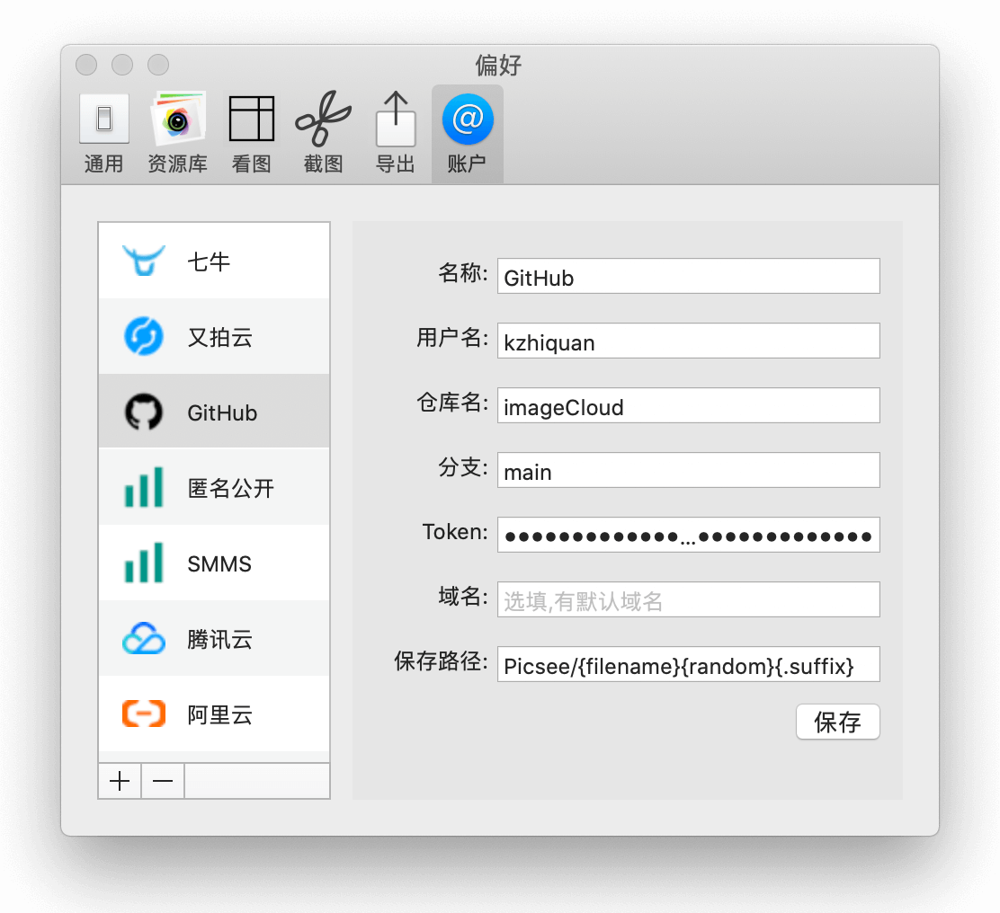
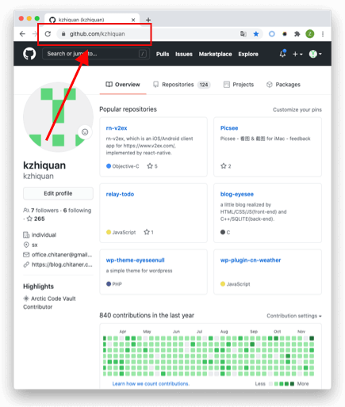
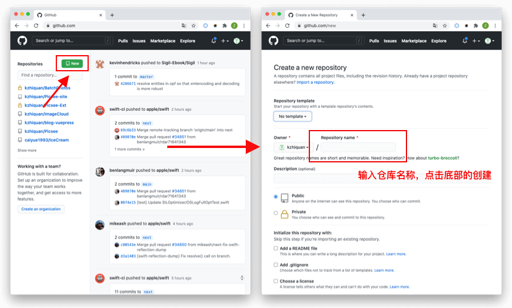
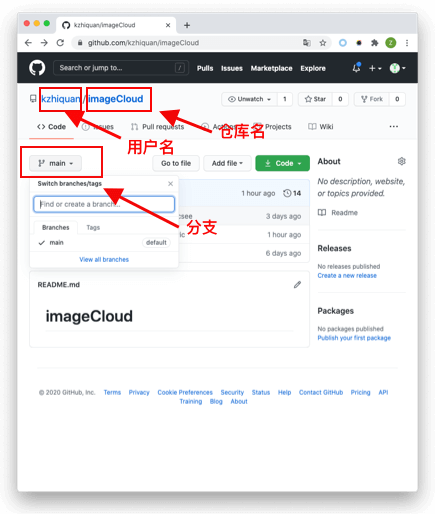
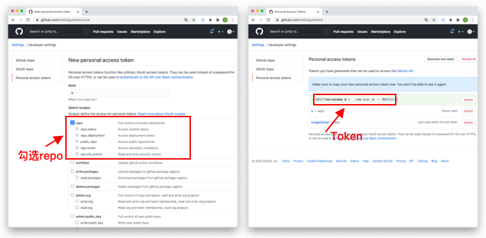
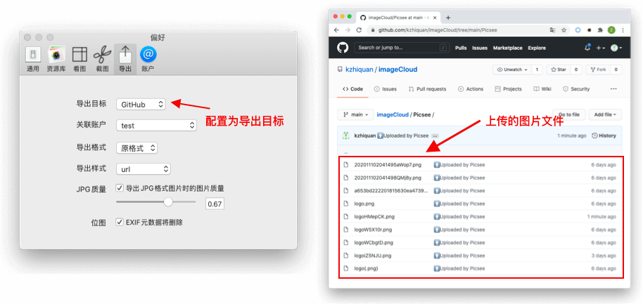

Github是一个代码托管平台，被挖掘出来做图床，可以免费使用，没有容量的限制，配置较简单，但在国外，速度比较慢。.....
<!-- more -->

## 配置说明

### 名称
**名称**：可以填入任何字符，标识这个配置。

### 用户名
**用户名**：Github的用户名。注册GitHub成功后的用户名称。例如我的个人主页[https://github.com/kzhiquan](https://github.com/kzhiquan), 用户名就是：**kzhiquan**。

### 仓库名
**仓库名**：存储上传文件的仓库名称。如果没有，则需先创建。在https://github.com页面，点击**New**按钮，出来创建页面，输入仓库名称，点击创建。

### 分支
**分支**：是选定仓库的分支名称，默认是**main**, 在仓库的主页面，例如我创建的仓库名为：**imageCloud**, 则仓库的主页面为[https://github.com/kzhiquan/imageCloud](https://github.com/kzhiquan/imageCloud),可以找到对应的分支名称。

### Token
**Token**: GitHub的个人访问令牌(personal access token)。可以在[https://github.com/settings/tokens/new](https://github.com/settings/tokens/new)创建，输入Note, 勾选repo, 点击Generate token创建，复制生成的token填入。**注意token的存储，不要泄露**

### 域名
**域名**：默认为空，不用设置。如果配置了自定义的域名，可以填入。

### 保存路径
**保存路径**：图片文件在仓库中的存储路径和名称设置。

## 效果：
在Picsee偏好设置的导出配置中，配置为默认导出，导出图片文件后，在GitHub仓库中，会有相应的图片存储着。

## 联系
- 详细介绍：[https://picsee.chitaner.com](https://picsee.chitaner.com)
- 邮件联系：[office.chitaner@gmail.com](mailto:office.chitaner@gmail.com)
- Telegram: [(https://t.me/joinchat/LLvGKBYvdMtz6z7SgYxJUQ)](https://t.me/joinchat/LLvGKBYvdMtz6z7SgYxJUQ)
- QQ群：663988917