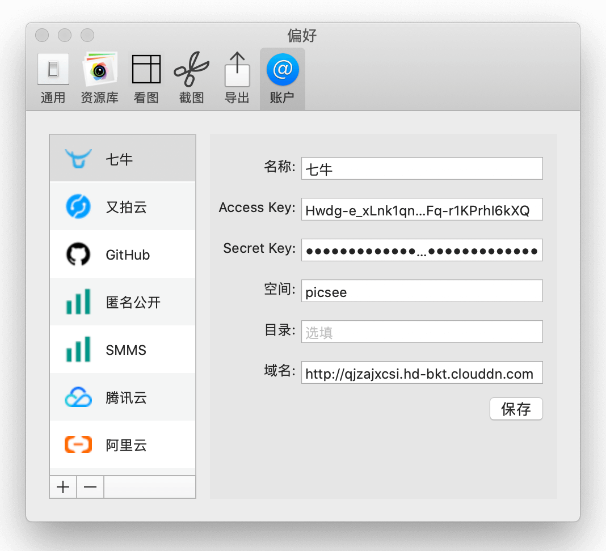
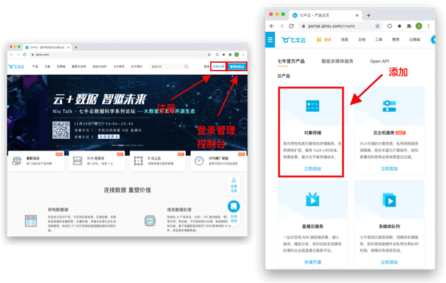
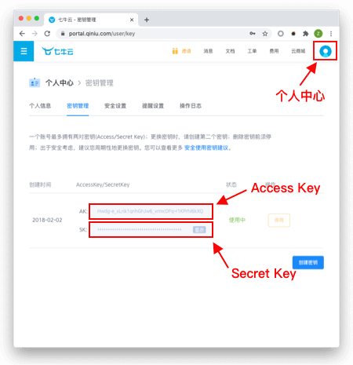
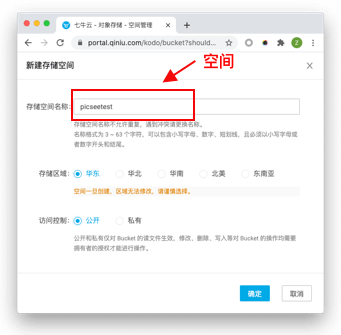
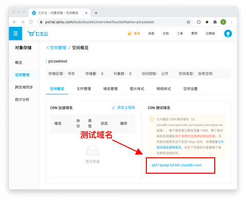
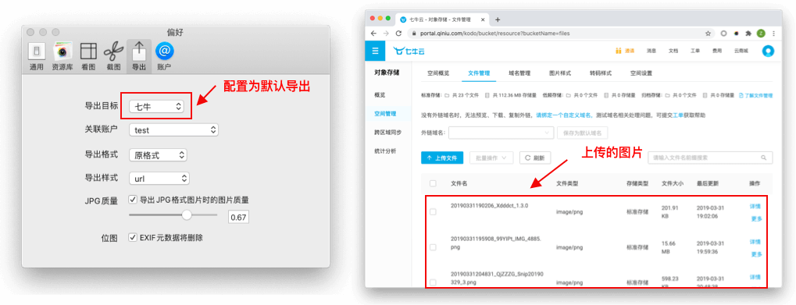

[七牛云Kodo](https://qiniu.com)是国内的云产品，提供给已认证个人用户10GB的免费存储空间，但需要自己绑定域名，平台只提供一个月使用时间的测试的域名。.....<!-- more -->

## 配置说明
配置前，先注册，在[官方首页](https://qiniu.com)注册成功后，登录管理控制台。

### 名称：
**名称**：可以填入任何字符，唯一标识这个配置。

### Access Key和Secret Key
**Access Key**: 访问密钥，**Secret Key**:密钥，登录管理控制后，在个人中心，密钥管理中获取，**注意保管，不要泄露**。

### 空间
**空间**： 存储图片文件的地方。登录七牛云管理控制台，添加对象存储，进行储存空间的创建。**记录存储空间名称**，填入Picsee的配置中。选择存储区域，选择物理上距离相近的区域；访问控制，选择公开。点击确定，进行创建。

### 目录
**目录**：可空，即上传的图片文件在空间中存储的文件夹。

### 域名
**域名**，七牛云为每一个空间提供了一个月的测试域名，如果要长期使用，则需要绑定自己的域名，以公开访问上传的图片。作为示例，这里用测试域名进行配置，测试域名可以在空间概览面板中找到。

## 效果：
添加七牛云账户后，在Picsee偏好设置的导出配置中，设置为默认导出，导出图片文件后，在七牛云的空间管理/文件管理面板中，可以找到相应的图片。

## 联系
- 详细介绍：[https://picsee.chitaner.com](https://picsee.chitaner.com)
- 邮件联系：[office.chitaner@gmail.com](mailto:office.chitaner@gmail.com)
- Telegram: [(https://t.me/joinchat/LLvGKBYvdMtz6z7SgYxJUQ)](https://t.me/joinchat/LLvGKBYvdMtz6z7SgYxJUQ)
- QQ群：663988917

