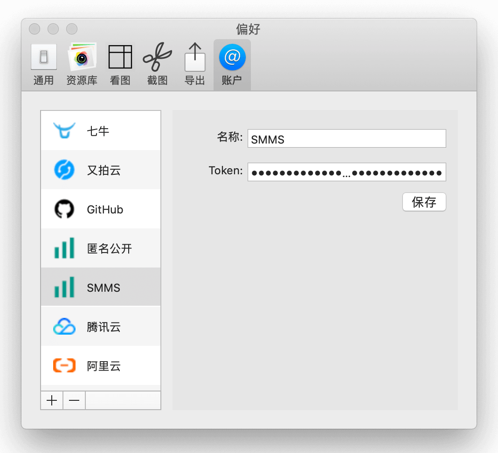
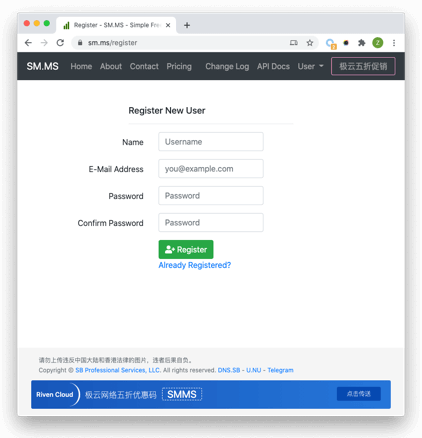
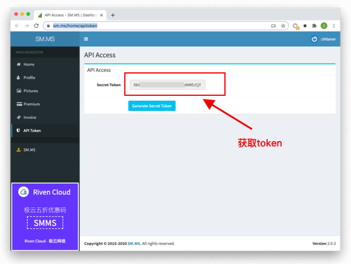
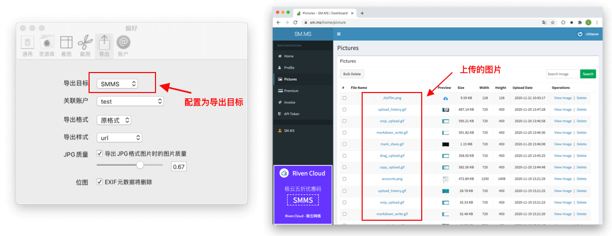

[SMMS](https://sm.ms)图床，分注册版和非注册版（匿名版），匿名版可以免费使用，但是分享的图片有可能被删除，Picsee的默认导出图床就是SMMS的匿名版，无需配置，就可以使用。.....<!-- more -->注册版，需要先注册用户，免费使用，有容量限制，是5GB。详细的价格可参照[https://sm.ms/pricing](https://sm.ms/pricing).下面介绍其在Picsee中的配置。

## 配置说明
配置非常简单，只需注册用户后，获取token填入即可。

### 名称：
**名称**：可以填入任何字符，唯一标识这个配置。

### 注册用户
在[https://sm.ms/register](https://sm.ms/register)填入相关信息，完成注册。

### token
**Token**: SMMS的访问令牌。注册成功后，登录，通过[https://sm.ms/home/apitoken](https://sm.ms/home/apitoken)获取token。**注意token的保管，不要泄露**

## 效果：
添加SMMS配置后，在Picsee偏好设置的导出配置中，设置为默认导出，导出图片文件后，在SMMM的Pictures面板中，可以找到相应的图片。

## 联系
- 详细介绍：[https://picsee.chitaner.com](https://picsee.chitaner.com)
- 邮件联系：[office.chitaner@gmail.com](mailto:office.chitaner@gmail.com)
- Telegram: [(https://t.me/joinchat/LLvGKBYvdMtz6z7SgYxJUQ)](https://t.me/joinchat/LLvGKBYvdMtz6z7SgYxJUQ)
- QQ群：663988917