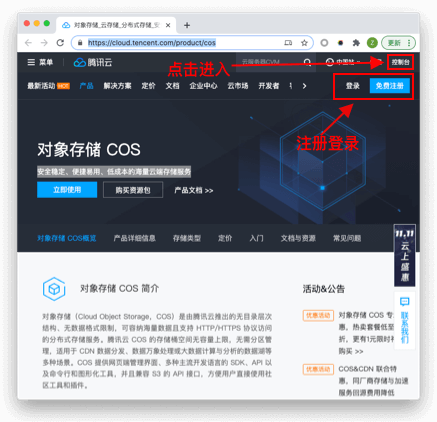
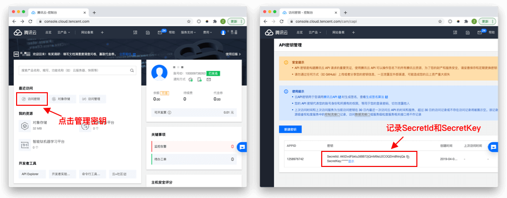
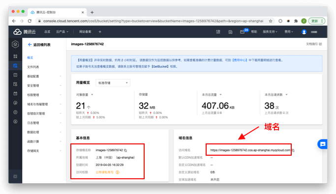
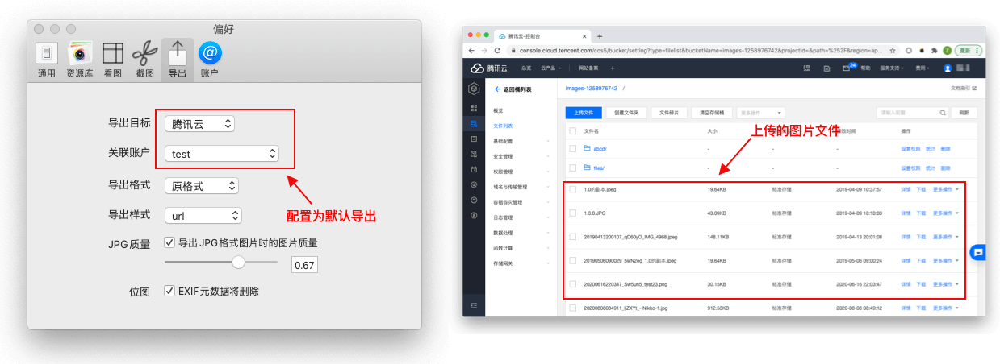

[腾讯云COS](https://cloud.tencent.com/product/cos)安全稳定、便捷易用、低成本的海量云端存储服务。.....<!-- more -->

## 配置说明
配置前，先注册，在[官方首页](https://cloud.tencent.com/product/cos)注册登录成功后，进入控制台。获取相关的配置信息。

### 名称：
**名称**：可以填入任何字符，唯一标识这个配置。

### SecretId和SecretKey
**SecretId**和**SecretKey**:腾讯云API请求的重要凭证，以APPID为管理单元，进入控制台后，点击访问密钥, 进入API密钥管理页面，可以新增密钥和查看已经创建的密钥。**注意保管，不要泄露**。

### 存储桶和区域
**‌存储桶**和**区域**：腾讯云以存储桶的形式管理存储空间，并以它为容器管理上传的图片文件。因此，需要创建存储桶，每个存储桶有一个区域。在控制台左侧导航面板中，点击存储桶列表,在右侧弹出的管理面板中，可以创建存储桶和查看以往创建的存储桶的信息。设置Bucket（存储空间）的名称，并选择相应的区域(地域节点)，创建存储桶后，记录名称和所属地域，填入Picsee的配置中。

### 目录
**目录**：可空，即上传的图片文件在存储桶哪个的文件夹中。

### 域名
**域名**，腾讯云COS为每一个存储桶提供了一个域名，以公开访问上传的图片。域名可以在存储桶的概览面板中找到。

## 效果：
添加腾讯云账户后，在Picsee偏好设置的导出配置中，设置为默认导出，导出图片文件后，在腾讯云的存储桶/文件列表面板中，可以找到相应的图片。

## 联系
- 详细介绍：[https://picsee.chitaner.com](https://picsee.chitaner.com)
- 邮件联系：[office.chitaner@gmail.com](mailto:office.chitaner@gmail.com)
- Telegram: [(https://t.me/joinchat/LLvGKBYvdMtz6z7SgYxJUQ)](https://t.me/joinchat/LLvGKBYvdMtz6z7SgYxJUQ)
- QQ群：663988917