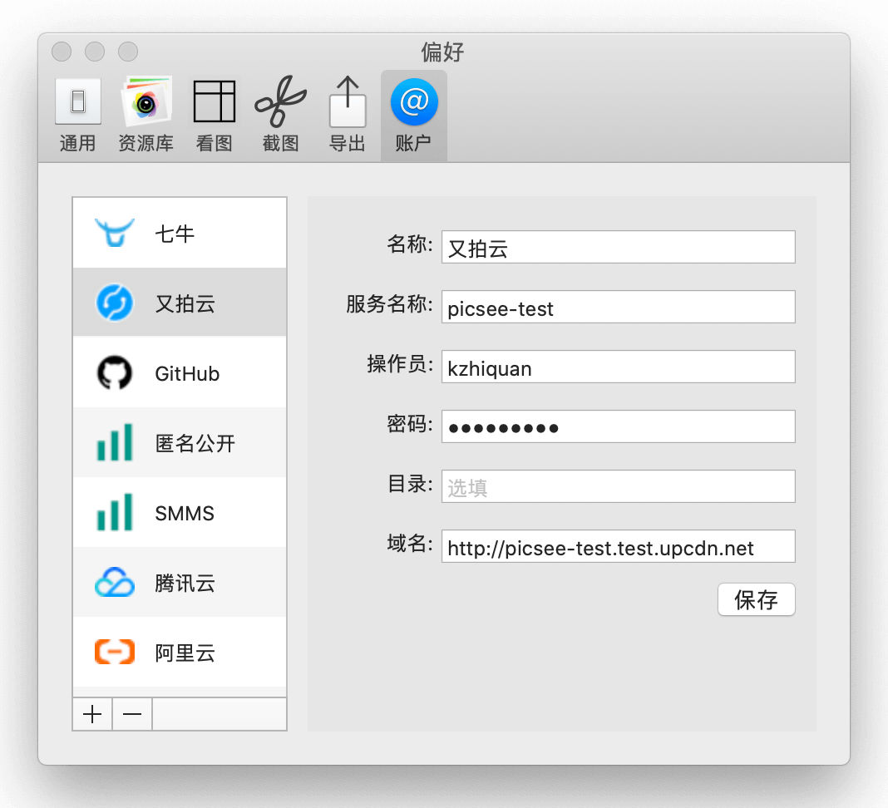
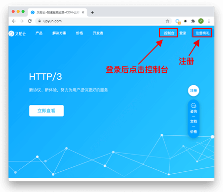
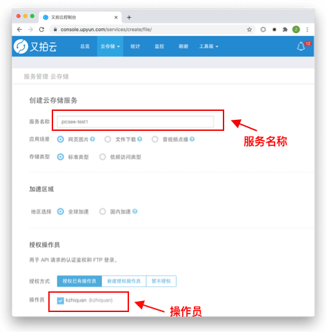
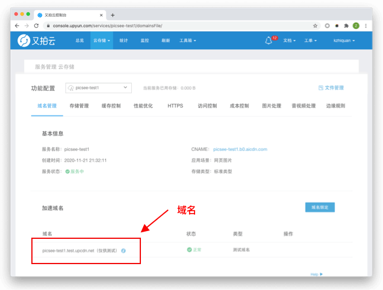
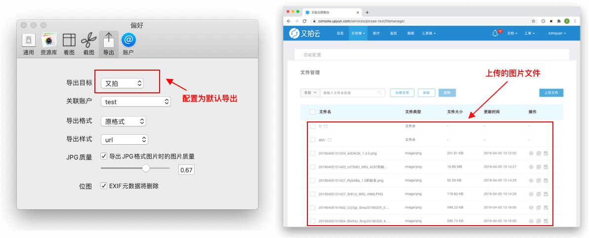

[又拍云USS](https://upyunm.com)，也需要绑定自己的域名，平台只提供测试域名。<!-- more -->

## 配置说明
配置前，先注册，在[官方首页](https://upyun.com)注册成功后，登录，点击控制台。获取相关配置的信息。

### 名称：
**名称**：可以填入任何字符，唯一标识这个配置。

### 服务名称
**服务名称**：又拍云云存储是以服务的形式提供的，进入控制台后，点击面板上的**云存储**，创建服务。填入服务名称，勾选操作员，进行创建，并做记录，配置进Picsee中。

### 密码：
**密码**： 即操作员的密码，**注意保管，不要泄露哦**

### 目录：
**目录**：可空，即上传的图片文件在服务的哪个文件夹中。

### 域名
**域名**，又拍云为每一个创建的服务提供了一个测试域名，如果自己有域名，可以进行绑定。作为示例，这里用测试域名进行配置，测试域名可以在服务的配置面板中找到。

## 效果：
添加又拍云账户后，在Picsee偏好设置的导出配置中，设置为默认导出，导出图片文件后，在又拍云相应服务的文件管理面板中，可以找到相应的图片。

## 联系
- 详细介绍：[https://picsee.chitaner.com](https://picsee.chitaner.com)
- 邮件联系：[office.chitaner@gmail.com](mailto:office.chitaner@gmail.com)
- Telegram: [(https://t.me/joinchat/LLvGKBYvdMtz6z7SgYxJUQ)](https://t.me/joinchat/LLvGKBYvdMtz6z7SgYxJUQ)
- QQ群：663988917