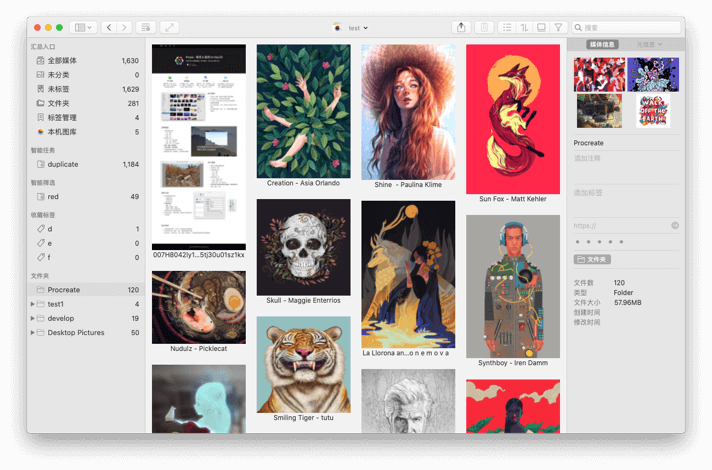

打磨阶段，产品难免有不足，大家可以通过，QQ群：663988917 ...... <!-- more --> Telegram: [(https://t.me/joinchat/LLvGKBYvdMtz6z7SgYxJUQ)](https://t.me/joinchat/LLvGKBYvdMtz6z7SgYxJUQ)交流

## 解决问题域
Picsee努力于图片收集、整理、查看、简单编辑、屏幕截图、图床分享问题域的解决。

## 迭代完善问题
Picsee软件的基础架构已完成，图片整理、查看、简单编辑、屏幕截图、图传分享模块化、组件化完成。各个模块的特性还需迭代完善打磨，与市面上的竞品还有一定距离，但不乏也有自身的优势特点。例如颜色筛选、相似图片查找、批量添加水印，长截图、云同步等。

## 浏览器插件问题 [2020.10.5已完成开发上线]
通过浏览器插件收集图片素材，后期会安排开发。目前，可以使用市面上一般的图片收藏下载浏览器插件替代，只要把其图片的下载目录设置为Picsee的管理文件夹，Picsee会监控管理文件夹的变动，下载后的图片素材，会自动添加到Picsee当前的图片资源束中。

## 云同步问题
Picsee通过管理文件目录的形式管理素材图片，因此，一定的配置后，搭配坚果云、Dropbox等主流云盘使用，可以完成多机素材图片的同步。此外，标签、评分、注释、智能文件夹等素材的自定义扩展数据通过iCloud完成多机的协同。

## 是否有Windows版本
Picsee采用Swift开发，数据库使用Realm。在一个比较长的时间里，不会有Windows版本，后期看软件发展情况，再定Windows版本的开发。

## 收费模式问题
Picsee各个模块还处于打磨阶段，目前，可免费直接从AppStore上[下载](https://apps.apple.com/cn/app/picsee-%E7%9C%8B%E5%9B%BE-%E6%88%AA%E5%9B%BE/id1454805783?mt=12)使用。后期收费，收费模式考虑订阅和按功能解锁相结合的方式进行。

