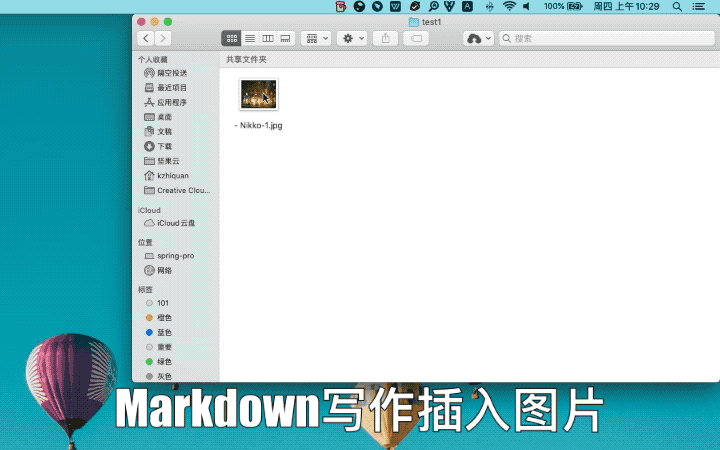
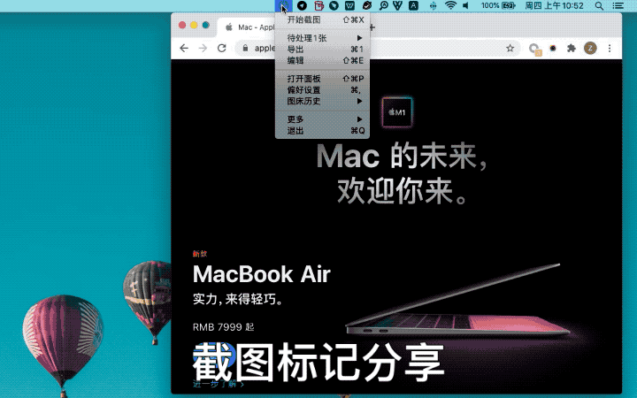
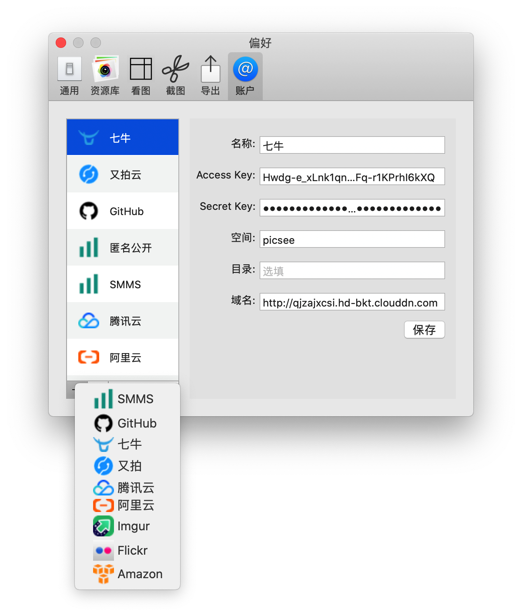
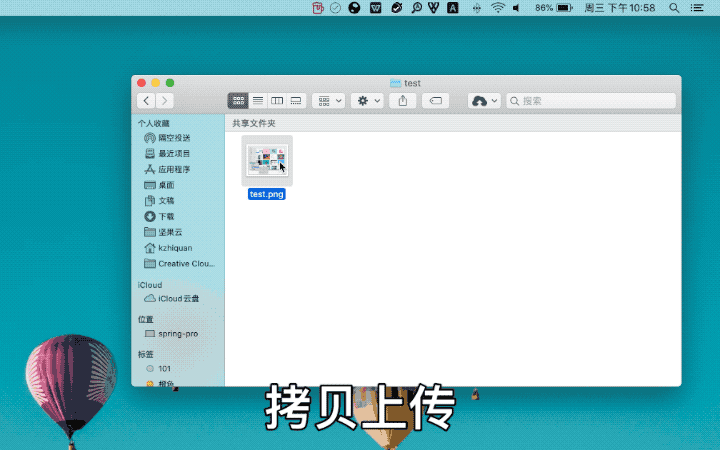
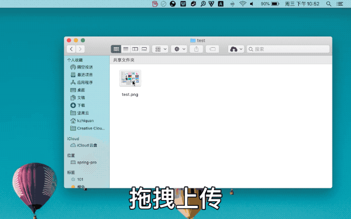
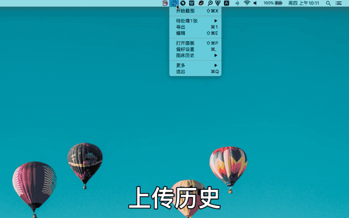

图床是Picsee延伸出来的功能，跟截图一样，使素材收集、整理、查看、分享的过程，更加流畅和完美。.....
<!-- more -->

当你在撰写文章、知乎讨论、豆瓣灌水、论坛盖楼，还是与别人IM交流，Picsee的图床功能都会给你带来愉悦的写作插入图片、分享图片体验。

## 图床云服务支持
目前，Picsee共支持10种图床，分别是:

- [SMMS](https://sm.ms/)
- [GitHub](https://github.com/)
- [码云Gitee](https://gitee.com/)
- [又拍云](https://www.upyun.com/products/file-storage)
- [腾讯云COS](https://cloud.tencent.com/product/cos)
- [阿里云OSS](https://cn.aliyun.com/product/oss)
- [七牛云](https://www.qiniu.com/products/kodo)
- [Amazon S3](https://aws.amazon.com/cn/s3/)
- [Imgur](https://imgur.com/)
- [Flickr](https://www.flickr.com/)

此外，对导出的链接也提供了个性化的配置，支持URL、Markdown、HTML、UBB格式。

## 多种上传方式支持
应对不同的使用场景，定制开发拷贝上传、截图上传、拖拽上传，随时随地获取图片云上链接。

### 拷贝上传
复制拷贝图片文件，从剪切板获取图片数据，上传到云端。

### 截图上传
快速截图屏幕图片、窗口，标记后，分享上传到云端。

### 拖拽上传
直接拖拽单个、多个图片文件到Picsee状态图标，上传到云端。

## 图床历史
记录上传到图床图片链接，随时查找过往的上传记录，再次获取云端链接。

## 配置说明帮助

- [SMMS](https://picsee.chitaner.com/blog/Picsee_imageCloud_smms.html)
- [GitHub](https://picsee.chitaner.com/blog/Picsee_imageCloud_github.html)
- [码云Gitee](https://picsee.chitaner.com/blog/Picsee_imageCloud_gitee.html)
- [又拍云](https://picsee.chitaner.com/blog/Picsee_imageCloud_upyun.html)
- [腾讯云COS](https://picsee.chitaner.com/blog/Picsee_imageCloud_tencent.html)
- [阿里云OSS](https://picsee.chitaner.com/blog/Picsee_imageCloud_aliyun.html)
- [七牛云](https://picsee.chitaner.com/blog/Picsee_imageCloud_qiniu.html)
- [Amazon S3](https://picsee.chitaner.com/blog/Picsee_imageCloud_amazonS3.html)
- [Imgur](https://picsee.chitaner.com/blog/Picsee_imageCloud_imgur.html)
- [Flickr](https://picsee.chitaner.com/blog/Picsee_imageCloud_flickr.html)