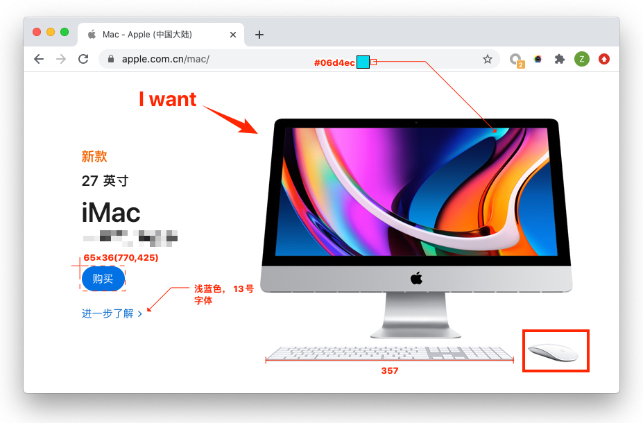
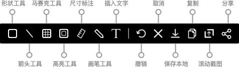
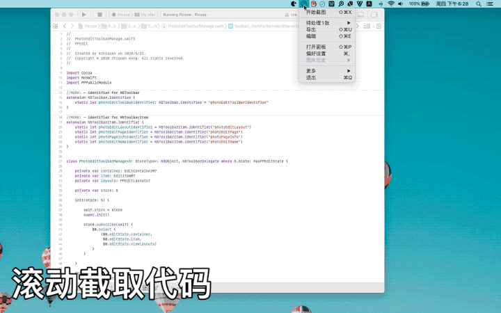
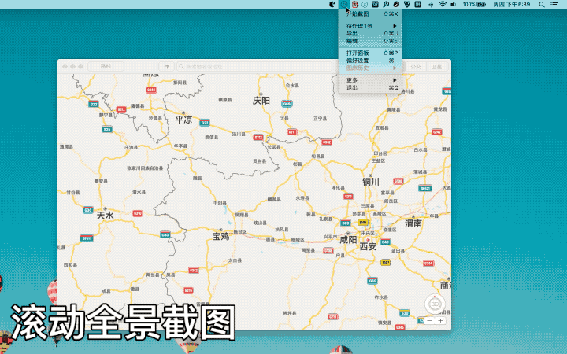
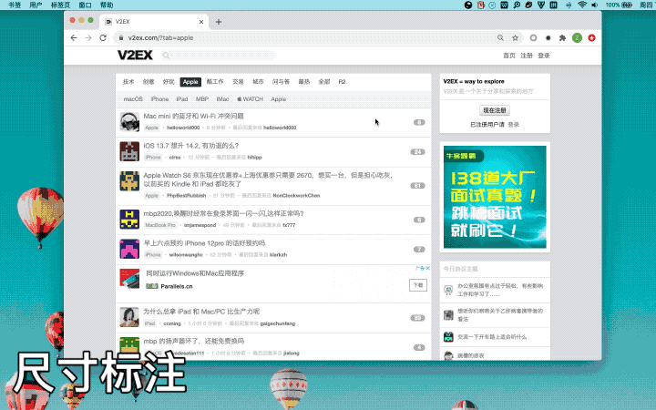
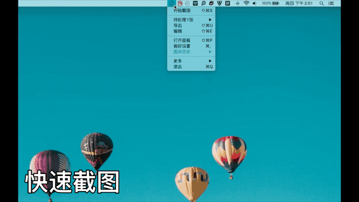
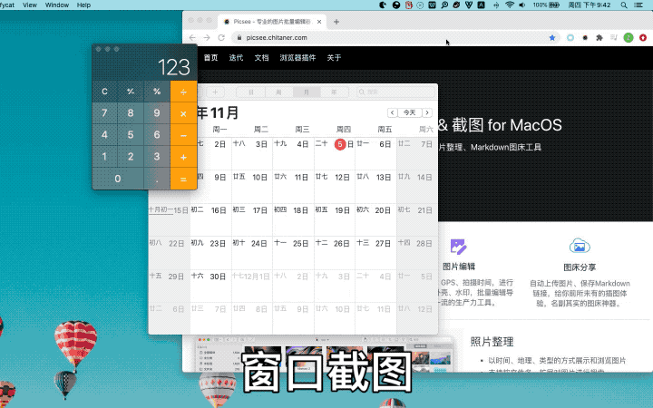
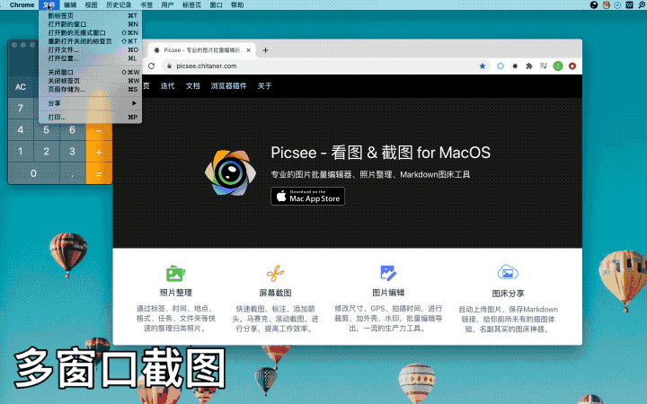

Picsee虽然是一款素材管理工具，但也提供了比较完整的截图功能，因此，我想，还是有必要介绍截图的各个功能点，其中，不乏有些亮点。 .....
<!-- more -->

Picsee的截图主要功能有：区域截图、窗口截图、多窗口截图、长截图、全景截图、快速标注、丈量尺寸、取色等。

## 快速标注
提供矩形、圆形、直线、箭头、马赛克、局部高亮、文字等标记工具。箭头、马赛克、高亮等提供多种样式，标注不再单一。

## 长截图
优化拼图算法，提升长截图用户体验，实现：

- 遇到非纯色背景、动态变化的内容也能比较好的处理
- 并可根据需要，长截图滚动完成时，也可以再次调整竖向或横向区域大小，再实现拼接。
- 还可截图时，按照Option键，选中窗口，对某些窗口进行长截图，自动拼接边缘区域。

## 全景截图
当需要拼接的截图区域异常大时，例如地图、名画等，可使用全景360无死角，进行全方位的滚动截取拼图。

## 尺寸标注
提供长度标记、坐标和矩形标记、色值标记、文字标记，方便进行UI尺寸的丈量和说明

## 区域截图
支持自定义截图快捷键，快速截图、标记分享

## 窗口截图
支持智能识别单窗口

## 多窗口截图
支持智能识别多窗口

