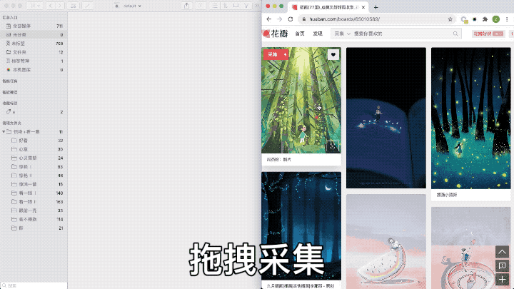
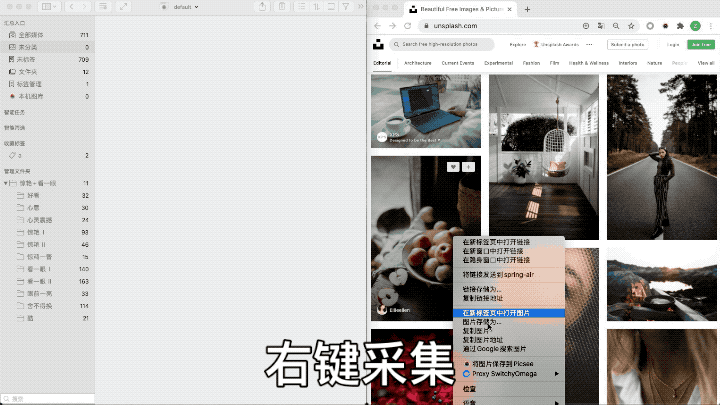
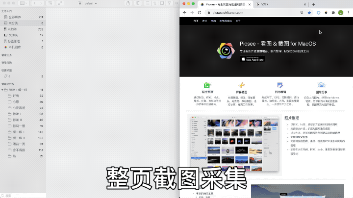
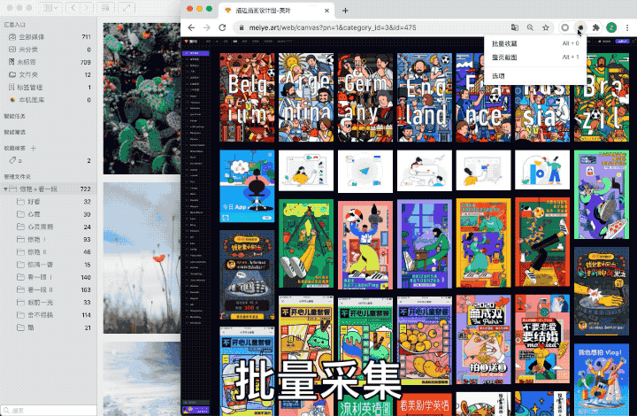

逛[淘宝](https://www.taobao.com/)，看到中意的宝贝，想把图片保存下来；浏览[Unsplash](https://unsplash.com/), 对某张照片的拍摄角度特别感兴趣，想要下载下来；在[dribble](https://dribbble.com/)上寻找设计思路，有些设计图稿特别有启发，想留存在本地。Picsee浏览器插件正是应运于这些需求而生。<!-- more -->

通过Picsee浏览器插件，可以随心所欲地保存网页上的图片，绕过网站右键屏蔽、登录下载，所见即所得，快速收藏，只需一个简单的拖拽。

## 网页图片拖拽采集
拖拽图片，收藏

## 网页图片右键采集
右键菜单，收藏

## 网页整页截图采集
自动滚动，整页收藏

## 网页图片批量采集
批量筛选收藏，避免一张一张下载

## 下载安装
Picsee浏览器采集图片插件，目前，需要配合[Picsee](https://picsee.chitaner.com)使用，请先下载安装[Picsee](https://picsee.chitaner.com)，再进行浏览器插件的安装使用。

- [插件下载安装流程](https://picsee.chitaner.com/webExtension)
