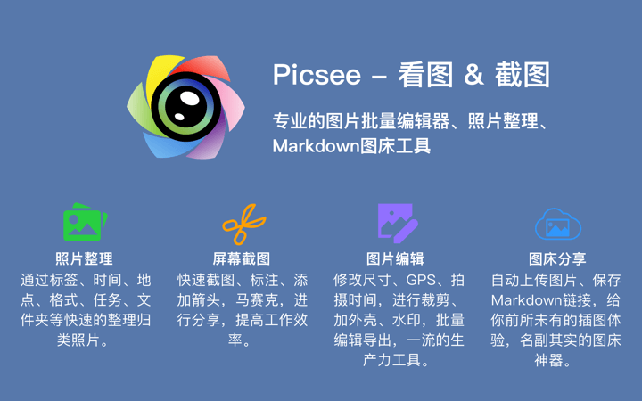

素材管理, 不二选择。素材整理、收集、分享全流程协助。
看图浏览, 极佳体验。操作方便、反应快速、支持格式众多。
截图标注, 得心应手。滚动截图、马赛克、尺寸、颜色标注功能丰富.
<!-- more -->

注释：1.2.7版本以前封面图，以留作纪念，此版本后，更新logo，更新官方站点.

## 素材管理
- 支持文件夹整理，多层级分类归类
- 支持文件夹下，素材的堆栈整理
- 支持建立标签体系，为素材打标签，快速定位
- 支持按颜色、关键字、形状、尺寸、类型等条件查找筛选
- 支持建立智能文件夹，按名称、标签、颜色等条件自动分类
- 支持按格式、年、月、日、地理位置、大小等属性，进行分栏
- 支持根据尺寸、时间、光圈等属性，批量重命名
- 支持自适应、瀑布流、网格布局浏览
- 支持标签、注释、评分等信息的iCloud同步、多机协同
- 支持相似图片的查找、删除
- 支持对iPhoto照片库的查看和管理
- 支持外部设备（手机、相机）等PTP设备媒体素材的查看、导出
- 支持素材包的导入导出、eagle素材包的导入、花瓣面板素材的导入
- 践行“相互独立、完全穷尽”原则，支持文件夹“一对一”，标签“一对多”素材整理方法
- 基于系统文件夹，与资源管理器融合，不复制拷贝，监听文件夹变化，双向同步关联素材

## 看图
- 支持全屏浏览图片
- 支持沉浸式浏览，无边框设计
- 操作便捷，鼠标滚轮放缩、翻页、抓手移动
- 支持EXIF信息的查看、图片的旋转、翻转查看
- 支持格式丰富，直接打开heic、psd, raw、webp、svg、ai、eps、raw等格式

## 截图
- 支持截图标注
- 支持截图取色
- 支持多窗口截图
- 支持长截图、横向截图、全景截图，即滚动截图
- 支持矩形、箭头、文字、马赛克、高亮、距离、区域、颜色等标注

## 编辑
- 支持图片的裁剪
- 支持添加放大镜
- 支持批量添加水印
- 支持批量添加外壳
- 支持批量修改图片格式导出
- 支持批量修改图片的尺寸、属性

## 图床
- 支持七牛、腾讯云、阿里云、又拍云图床
- 支持Imgur、Flickr、Amazon S3图床
- 支持Github、SM.MS、码云Gitee图床
- 支持拖拽、服务、复制、截图导出到图床
- 支持设置默认图床、导出历史查看和管理

## 素材收集
- 支持截图收集
- 支持浏览器插件收集
- 支持网页上的图片拖拽收集
- 支持网页整页图片批量收集
- 支持网页整页截图收集

## 下载

## 联系
- 详细介绍：[https://picsee.chitaner.com](https://picsee.chitaner.com)
- 邮件联系：[office.chitaner@gmail.com](mailto:office.chitaner@gmail.com)
- Telegram: [(https://t.me/joinchat/LLvGKBYvdMtz6z7SgYxJUQ)](https://t.me/joinchat/LLvGKBYvdMtz6z7SgYxJUQ)
- Twitter：[Twitter @chitanerk](https://twitter.com/chitanerk)
- QQ群：663988917