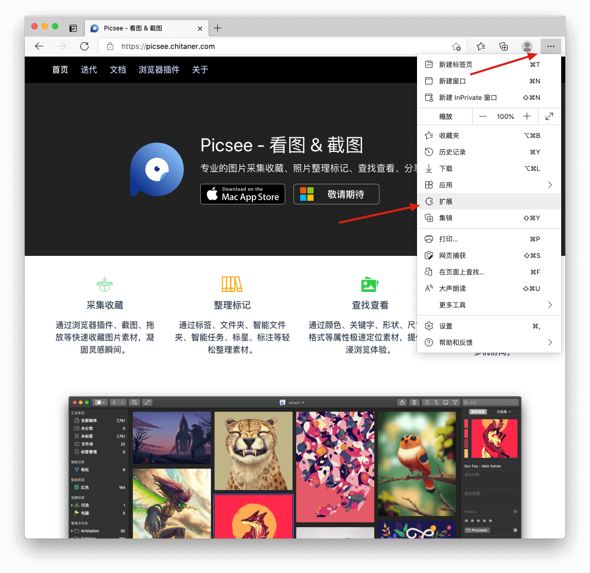
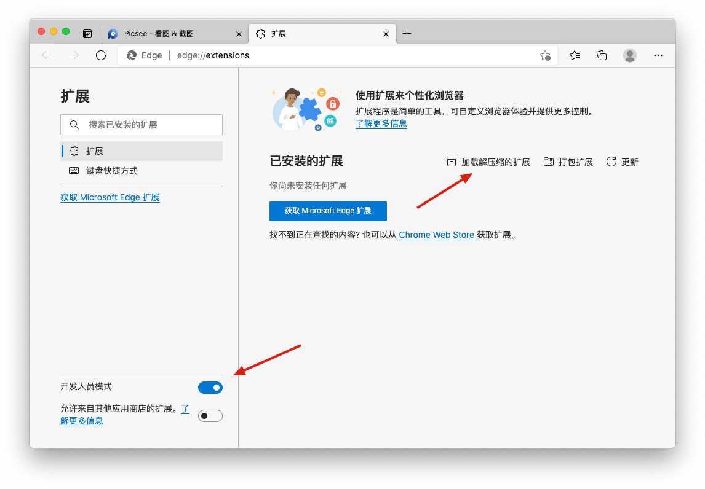
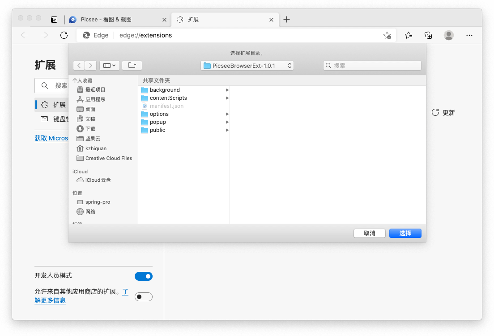
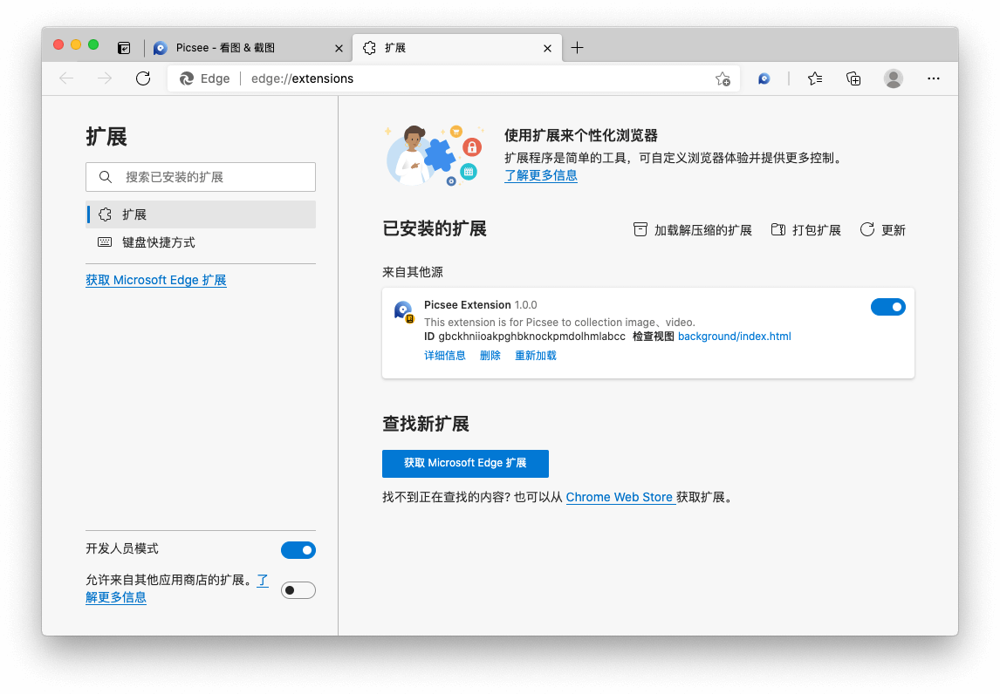
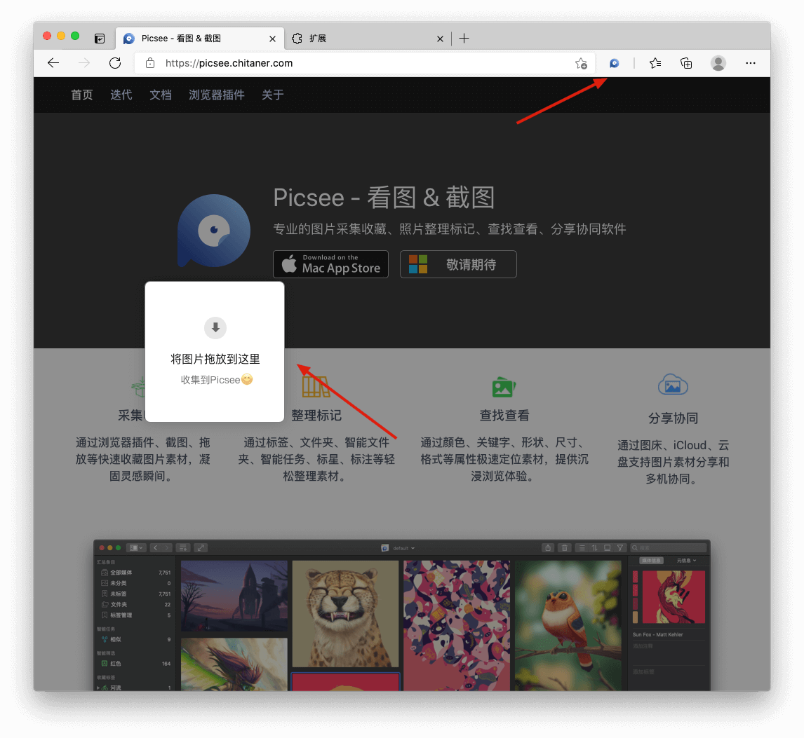

目前，未上架微软Edge插件商店，但提供离线包下载，可手动安装。本篇，介绍下，下载安装流程 ......

## 下载
点击**‌[离线包](./images/chrome_offline_package_install/PicseeBrowserExt-1.0.1.zip)**, 下载zip文件，下载完成后，解压文件。

## 安装说明
### 打开扩展程序页面
打开Edge浏览器，在右上角菜单栏处，点击**设置及其他**, 在弹出的菜单中找到**扩展**，点击打开。

### 进入开发者模式
在打开的页面，左下角，找到**开发人员模式**，开启。

### 安装扩展程序
点击**加载解压缩的扩展**

在弹出的文件夹选择对话框中，定位到刚才**下载的离线包解压出来的文件夹**，点击选择，完成安装。

### 安装完成
安装完成后，在右上角就可以看到Picsee插件的图标，刷新已打开的网页或者重新打开网页，拖动网页上的图片，就可以开始使用了。

### 开始使用
- 支持网页上的图片拖拽收集
- 支持网页整页图片批量收集
- 支持网页整页截图收集
- 支持右键菜单、快捷键收集
- 注：插件安装前，已打开的页面，需要刷新后，才能正常使用；注意保存下载下来插件解压出的文件夹，不要移动或者删除。